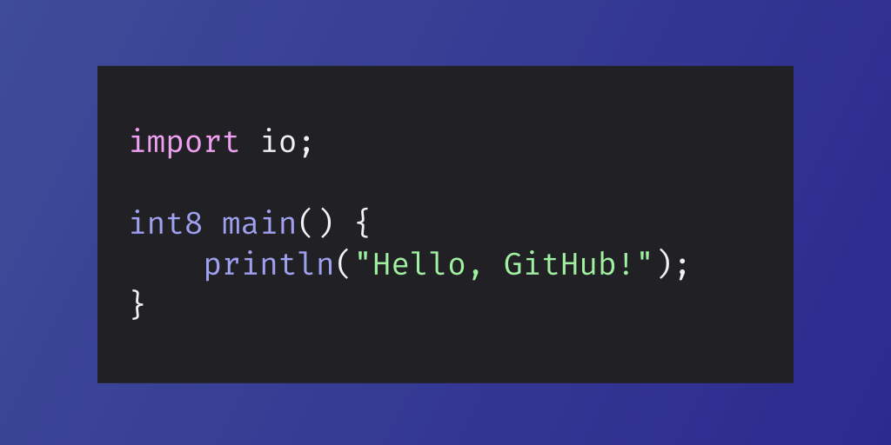

# Hexagn: Programming language


A simple compiler capable of compiling Hexagn to URCL code. With an easy-to-read C-like syntax, understanding it is easy.

<p align="center"></p>

*Preview of Hexagn syntax.*

## Prerequisites

If you are running a Windows NT system, please use WSL (Windows Subsystem for Linux) (while you can install Rust in Windows, it is better if it is inside a Linux environment), and if you are using MacOS or (any) Linux (distro), you can continue the installation process.

Recommended to install the Rust programming language via [Rustup](https://rustup.rs) to get both `rustc` and `cargo`

- Rust programming language
- (Rust's) Cargo

## Installation (unstable)

Currently, there are no stable releases of Hexagn, cloning the repository directly will give you the in-development or unstable version.

1. Clone the repository via any option in the **<> Code** tab
2. Run the following commands in the `Hexagn/` directory (the cloned repository)
```
cargo build --release
cargo install --path .
```
3. You can now use the `hexagn` command anywhere in your shell (might require a shell restart)

## Contributing

You can help the project by contributing to it via forking it. Instructions on how to fork it can be found [here](https://docs.github.com/en/get-started/quickstart/contributing-to-projects).

## GitHub Pages

Hexagn has its dedicated page hosted via GitHub pages at [notalternate.github.io.](https://notalternate.github.io/hexagn/)

What does it have to offer? A full detailed description, documentation, and installation process of the language.

## Official Discord server

[Visit the official Hexagn Discord server!](https://discord.gg/invite/t75crS5XBe)

## License

Repository licensed under the [MIT](LICENSE) license.