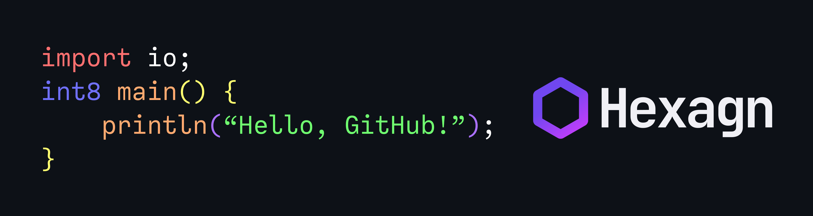

# Hexagn: Higher-up for URCL

A simple compiler capable of compiling programs written in the Hexagn programming language to URCL.
The Hexagn language with its C-like syntax allows anyone to easily understand it.

<p align="center"></p>

*Preview of the Hexagn's logo and syntax; Outputting "Hello, GitHub!"*

## Prerequisites

If you are running a Windows NT system, WSL (Windows Subsystem for Linux) is recommended. Although it should work in NT systems, it is not tested.<br>
However, if you are using MacOS or (any) Linux (distro), you can continue the installation process.

It is recommended to install the Rust programming language via ([Rustup](https://rustup.rs))

- Rust programming language
- `git` or `gh` ([Github CLI](https://cli.github.com/)) <br> *\* not required if you download the repository via Web or Desktop*

## Installation (unstable)

Currently, there are no stable releases of the compiler, cloning the repository directly will give you the in-development or unstable version.
Proceed if you are willing to face consequences.

#### CLONING, BUILDING AND INSTALLING

1. Clone the repository via any option in the "**<> Code**" tab, which can be found on the top of the GitHub repository's page.
2. Run the following command in the `./Hexagn/` directory (The cloned repository, replace if you cloned under a different name).
```sh
$ cargo build --release; cargo install --path .
```
3. The compiler should be compiled as an executable inside the `./target/release/` directory and installed to your Cargo binaries.
4. You should now be able to use the command `hexagn` anywhere, as long it is within the same shell.

## Executable details

\* *`<>` Denotes required, `[]` Denotes optional.*

```
hexagn <INPUT FILE> [FLAGS]
```

#### BUILT-IN COMMANDS

`-h`, `--help`: Highlights available options and parametres.<br>

#### BUILT-IN FLAGS

`-o <OUTPUT FILE>`: Overwrites which output file to compile to. (Default: `out.urcl`)<br>
`-l <LIBRARY PATH>`: Includes library path in compiling phase.<br>
`-O <LEVEL>`: Selects a specific optimisation level.<br>
`-g`: Enables debug symbols.<br>
`--no-main`: Removes entry-point on compiled file, Rendering the code as a library.

## Contributing

You can support the project by contributing to it via forking the repository, commit changes and opening up a pull request (Instructions on how to fork it can be read [here](https://docs.github.com/en/get-started/quickstart/contributing-to-projects)), leaving a feedback or reporting an issue.

After a pull request, please be patient for maintainers to review and manage conflicts.

Contributing to this repository renders you as a collaborator of **this compiler repository**, not the Hexagn project.

## Legal notice

The Hexagn compiler repository owned by GameBuilder202, Hosted at [GitHub](https://github.com/GameBuilder202/Hexagn) is licensed under the [Apache License, Version 2.0](LICENSE).

The name "Hexagn" and the "Hexagn Logo" are trademarks of The Hexagn Project.
Exclusive permission granted, SECTION-3: PERMITS of the [THP Trademark Policy](https://notalternate.github.io/hexagn/legal).